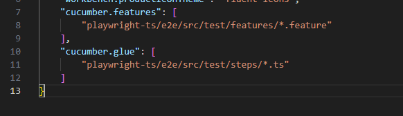

# Playwright + CUCUMBER


## Features
1. report with screenshots, videos & logs
2. Execute tests on multiple environments 
3. Parallel execution
4. Rerun only failed features
5. Retry failed tests on CI
6. Page object model

## Project structure

- src -> Contains all the features & Typescript code
- test-results -> Contains all the reports related file

### Setup:

1. Clone or download the project
2. Extract and open in the VS-Code
3. be sure that you are on the path "playwright\ui>" to execute the next comands 
4. `npm i` to install the dependencies
5. `npx playwright install` to install the browsers
6. `npm run test` to execute the tests
7. To run a particular test change  
```
  paths: [
            "src/test/features/featurename.feature"
         ] 
```
8. Use tags to run a specific or collection of specs
```
npm run test --TAGS="@Test1"
```

### If you are seeing the problem "Undefined step" on the feature file
1. Go to your settings
2. Search cucumber
3. Click on "Edit settings.json" 
4. Be sure that the correct path is inserted on the 'cucumber.feature' and 'cucumber.glue' as the next image: 


### Folder structure
0. `src\pages` -> All the page (UI screen)
1. `src\test\features` -> write your features here
2. `src\test\steps` -> Your step definitions goes here
3. `src\hooks\hooks.ts` -> Browser setup and teardown logic
4. `src\hooks\pageFixture.ts` -> Simple way to share the page objects to steps
5. `src\helper\env` -> Multiple environments are handled
6. `src\helper\types` -> To get environment code suggestions
7. `src\helper\report` -> To generate the report
8. `config/cucumber.js` -> One file to do all the magic
9. `package.json` -> Contains all the dependencies
11. `src\helper\util` -> Read test data from json & logger

